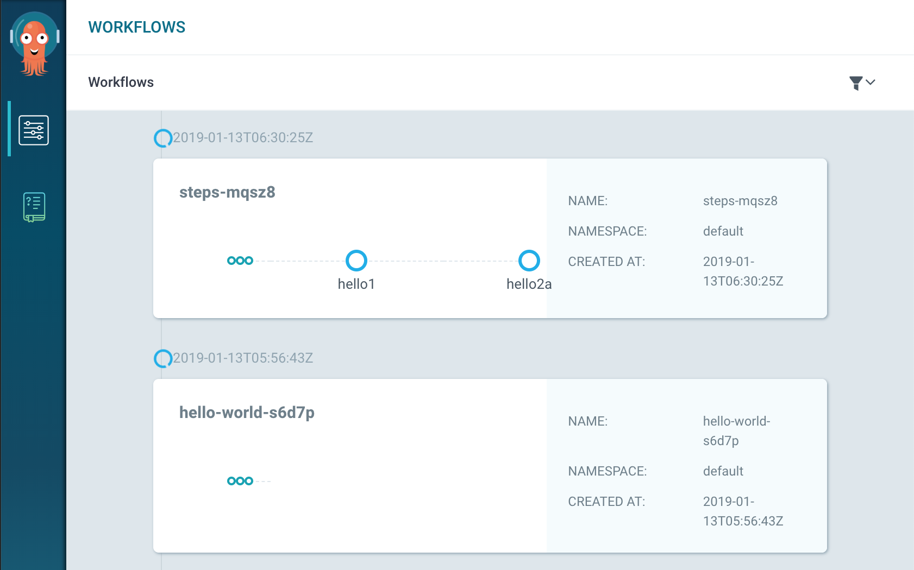
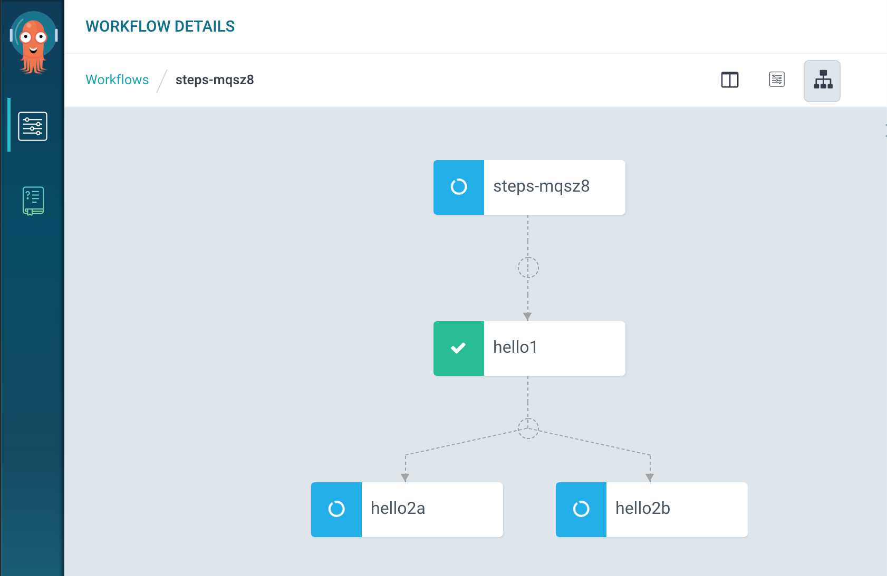

argo를 알아보자.

<!--more-->

argo는 컨테이너 워크플로우 솔루션이다.

워크플로우 스펙을 YAML 파일로 정의하고, 실행할때 마다 컨테이너를 생성해서 작업을 수행한다.

[Open source container-native workflow engine for Kubernetes. argo](https://argoproj.github.io/)

argo 공식홈페이지에 나와있는 example을 실행해보자.

먼저 yaml 파일을 다음과 같이 생성한다.

~~~yaml
apiVersion: argoproj.io/v1alpha1
kind: Workflow                  #new type of k8s spec
metadata:
    generateName: hello-world-    #name of workflow spec
spec:
    entrypoint: whalesay          #invoke the whalesay template
    templates:
    - name: whalesay              #name of template
    container:
        image: docker/whalesay
        command: [cowsay]
        args: ["hello world"]
        resources:                #don't use too much resources
        limits:
            memory: 32Mi
            cpu: 100m
~~~

생성후 kubernetes에 submit 한다.

~~~bash
$ argo submit hello-world.yaml
~~~

현재 워크플로우 list를 보려면 list 명령어를 이용한다.

~~~bash

$ argo list

NAME                STATUS    AGE   DURATION
hello-world-s6d7p   Running   10m   10m

~~~
생성된 pod 의 상태를보려면 get 명령어를 이용

~~~bash

$ argo get hello-world-s6d7p

Name:                hello-world-s6d7p
Namespace:           default
ServiceAccount:      default
Status:              Running
Created:             Sun Jan 13 14:56:43 +0900 (11 minutes ago)
Started:             Sun Jan 13 14:56:52 +0900 (10 minutes ago)
Duration:            10 minutes 52 seconds

STEP                  PODNAME            DURATION  MESSAGE
    ● hello-world-s6d7p  hello-world-s6d7p  10m

~~~

마찬가지로 log를 보려면 log  명령어를 이용

~~~bash

$ argo logs -w hello-world-xxx    # get logs from all steps in a workflow

argo logs -w hello-world-s6d7p
hello-world-s6d7p:	 _____________
hello-world-s6d7p:	< hello world >
hello-world-s6d7p:	 -------------
hello-world-s6d7p:	    \
hello-world-s6d7p:	     \
hello-world-s6d7p:	      \
hello-world-s6d7p:	                    ##        .
hello-world-s6d7p:	              ## ## ##       ==
hello-world-s6d7p:	           ## ## ## ##      ===
hello-world-s6d7p:	       /""""""""""""""""___/ ===
hello-world-s6d7p:	      {~~ ~~~~ ~~~ ~~~~ ~~ ~ /  ===- 
hello-world-s6d7p:	       \______ o          __/
hello-world-s6d7p:	        \    \        __/
hello-world-s6d7p:	          \____\______/

$ argo logs hello-world-xxx-yyy   # get logs from a specific step in a workflow

argo logs hello-world-s6d7p
    _____________
< hello world >
    -------------
    \
        \
        \
                    ##        .
                ## ## ##       ==
            ## ## ## ##      ===
        /""""""""""""""""___/ ===
        {~~ ~~~~ ~~~ ~~~~ ~~ ~ /  ===- 
        \______ o          __/
        \    \        __/
            \____\______/

~~~

delete

~~~bash

$ argo delete hello-world-xxx

~~~

## ArgoUI

CLI가 아닌 GUI로 확인하기 위해 argo-ui를 로컬 PC 로 포워딩 한다.

~~~bash

$ kubectl -n argo port-forward deployment/argo-ui 8001:8001

~~~

## 연속작업

다음과 같이 워크플로우를 작성한다.

~~~yaml
apiVersion: argoproj.io/v1alpha1
kind: Workflow
metadata:
    generateName: steps-
spec:
    entrypoint: hello-hello-hello

    # This spec contains two templates: hello-hello-hello and whalesay
    templates:
    - name: hello-hello-hello
    # Instead of just running a container
    # This template has a sequence of steps
    steps:
    - - name: hello1            #hello1 is run before the following steps
        template: whalesay
        arguments:
            parameters:
            - name: message
            value: "hello1"
    - - name: hello2a           #double dash => run after previous step
        template: whalesay
        arguments:
            parameters:
            - name: message
            value: "hello2a"
        - name: hello2b           #single dash => run in parallel with previous step
        template: whalesay
        arguments:
            parameters:
            - name: message
            value: "hello2b"

    # This is the same template as from the previous example
    - name: whalesay
    inputs:
        parameters:
        - name: message
    container:
        image: docker/whalesay
        command: [cowsay]
        args: ["{{inputs.parameters.message}}"]
~~~

- Metadata에서 `generateName: steps-` 는 워크플로우 이름이다.
- 워크플로우는 templates부분에 정의 되어있는데 hello1과 hello2a를 보면 앞에  `- -` 2개의 -가 정의되어있고 hello2b 같은경우는 1개의 -로 되어있는 것을 볼 수 있다. 이는 hello2a, hello2b를 동시에 실행하는 것을 의미한다.

다시 실행해보자.

~~~bash

$ argo submit --watch helloworld-multi.yaml

Name:                steps-nt72p
Namespace:           argo
ServiceAccount:      default
Status:              Succeeded
Created:             Sun Jan 13 15:39:55 +0900 (5 seconds ago)
Started:             Sun Jan 13 15:39:55 +0900 (5 seconds ago)
Finished:            Sun Jan 13 15:40:00 +0900 (now)
Duration:            5 seconds

STEP            PODNAME                 DURATION  MESSAGE
    ✔ steps-nt72p
    ├---✔ hello1   steps-nt72p-1112559031  1s
    └-·-✔ hello2a  steps-nt72p-220736832   1s
    └-✔ hello2b  steps-nt72p-271069689   2s

~~~

`--watch` 옵션은 각 단계별 실행 상태와 워크플로우 구조를 볼 수 있다.

step-~ 이라는 워크플로우가 생성되었다. 

**Warning Notice:** istio가 설치되어있는환경에서는 계속 running에서 대기중이던데 확인이 필요할 거 같다. istio가 적용안되어있는 namespace를 이용했더니 잘 작동했다.

## DAG를 이용한 워크플로우 정의

~~~yaml
apiVersion: argoproj.io/v1alpha1
kind: Workflow
metadata:
    generateName: dag-diamond-
spec:
    entrypoint: diamond
    templates:
    - name: echo
    inputs:
        parameters:
        - name: message
    container:
        image: alpine:3.7
        command: [echo, "{{inputs.parameters.message}}"]
    - name: diamond
    dag:
        tasks:
        - name: A
        template: echo
        arguments:
            parameters: [{name: message, value: A}]
        - name: B
        dependencies: [A]
        template: echo
        arguments:
            parameters: [{name: message, value: B}]
        - name: C
        dependencies: [A]
        template: echo
        arguments:
            parameters: [{name: message, value: C}]
        - name: D
        dependencies: [B, C]
        template: echo
        arguments:
            parameters: [{name: message, value: D}]
~~~

DAG를 이용하면 좀 더 명시적으로 워크플로우 정의가 가능하다.

A인 task가 실행하게 하고  B,C는 A에 의존성을 가지도록 하고 D는 B,C의 의존성을 가지게 해서 실행 순서는 A → B , C → D 형태가 된다.

이후 진행은 조대협님 블로그를 참고하였습니다.

[컨테이너 기반 워크플로우 솔루션 Argo](http://bcho.tistory.com/1299)

## 입력/출력값 전달

argo의 개념과 워크플로우의 개념을 이해했으면 

task간 데이터를 어떻게 전달하는지 살펴보자.

**입력값 전달**

~~~yaml
apiVersion: argoproj.io/v1alpha1
kind: Workflow
metadata:
    generateName: hello-world-parameters-
spec:
    # invoke the whalesay template with
    # "hello world" as the argument
    # to the message parameter
    entrypoint: whalesay
    arguments:
    parameters:
    - name: message
        value: hello world
    templates:
    - name: whalesay
    inputs:
        parameters:
        - name: message       #parameter declaration
    container:
        # run cowsay with that message input parameter as args
        image: docker/whalesay
        command: [cowsay]
        args: ["{{inputs.parameters.message}}"]
~~~

먼저 spec.arguments 부분에서 message라는 변수를 선언 하였고, 그값은 hello world로 되어 있다. 그리고 워크플로우의 whalesay 태스크에서 message 변수를 input 변수로 사용하도록 선언했다. input.parameters.message를 참조하여 message 변수의 값을 도커 컨테이터의 실행 변수로 넘기도록 하였다.

CLI에서 값을 변경하려면 

~~~bash

$ argo submit file.yaml -p {parameter name}={value}

~~~
## 출력값 사용

~~~yaml

apiVersion: argoproj.io/v1alpha1
kind: Workflow
metadata:
    generateName: output-parameter-
spec:
    entrypoint: output-parameter
    templates:
    - name: output-parameter
    steps:
    - - name: generate-parameter
        template: whalesay
    - - name: consume-parameter
        template: print-message
        arguments:
            parameters:
            # Pass the hello-param output from the generate-parameter step as the message input to print-message
            - name: message
            value: "{{steps.generate-parameter.outputs.parameters.hello-param}}"

    - name: whalesay
    container:
        image: docker/whalesay:latest
        command: [sh, -c]
        args: ["echo -n hello world > /tmp/hello_world.txt"]  #generate the content of hello_world.txt
    outputs:
        parameters:
        - name: hello-param       #name of output parameter
        valueFrom:
            path: /tmp/hello_world.txt    #set the value of hello-param to the contents of this hello-world.txt

    - name: print-message
    inputs:
        parameters:
        - name: message
    container:
        image: docker/whalesay:latest
        command: [cowsay]
        args: ["{{inputs.parameters.message}}"]
~~~

먼저 whalesay를 보면 outputs.parameters에 hello-param이라는 이름으로 output 변수를 정의하였고, output 내용은 /tmp/hello_world.txt 파일 내용으로 채워진다.

다음 print-message 컨테이너 정의 부분을 보면 input param으로 message라는 변수를 정의하였다. steps를 보면 print-message를 실행할때 message 변수의 값을 

{{steps.generate-parameter.outputs.parameters.hello-param}} 로 정의해 print-message의 이전 스탭인 generate-parameter의 output param 중에  hello-param이라는 변수의 값으로 채우는 것을 볼 수 있다.

## Artifact

워크 플로우 태스크에 대한 입/출력값을 parameter로 전달할 수 도 있지만, CI/CD 빌드 파이프라인에서는 소스코드, 빌드 바이너리가 될수 도 있고 빅데이터 파일일 수도 있다. 이 경우 parameter를 이용해서 넘기기는 부담이 된다.

이런경우 artifact라는 기능을 이용한다. 외부 저장소 AWS S3나 GCP GCS같은 곳에 저장할 수 있게하고 반대로 읽기도 가능하다.

나중에 kubeflow에서 텐서플로우 학습을 시키는 파이프라인이 있을때 학습된 모델을 S3나 GCS에 저장하도록 하는 작업을 할 수 있다.

parameter → artifact로만 변경하면 된다.

~~~yaml

apiVersion: argoproj.io/v1alpha1
kind: Workflow
metadata:
    generateName: artifact-passing-
spec:
    entrypoint: artifact-example
    templates:
    - name: artifact-example
    steps:
    - - name: generate-artifact
        template: whalesay
    - - name: consume-artifact
        template: print-message
        arguments:
            artifacts:
            # bind message to the hello-art artifact
            # generated by the generate-artifact step
            - name: message
            from: "{{steps.generate-artifact.outputs.artifacts.hello-art}}"

    - name: whalesay
    container:
        image: docker/whalesay:latest
        command: [sh, -c]
        args: ["cowsay hello world | tee /tmp/hello_world.txt"]
    outputs:
        artifacts:
        # generate hello-art artifact from /tmp/hello_world.txt
        # artifacts can be directories as well as files
        - name: hello-art
        path: /tmp/hello_world.txt

    - name: print-message
    inputs:
        artifacts:
        # unpack the message input artifact
        # and put it at /tmp/message
        - name: message
        path: /tmp/message
    container:
        image: alpine:latest
        command: [sh, -c]
        args: ["cat /tmp/message"]
