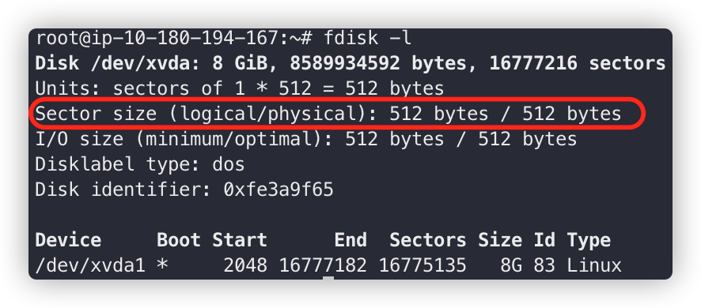

sector란 물리 디스크에 입출력을 요청하는 최소 단위이다.

<!--more-->

전통적인 하드 디스크는 512 Byte 크기의 sector들로 구성 되어 있다고 한다. 큰 데이터에 접근 하고자 할때 sector의 크기가 작으면 많은 입출력 요청이 발생해서 디스크 에서는 퍼포먼스를 올리기 위해 sector 자체 크기를 늘리고자 했다.

파일의 크기가 작아 하나의 sector를 채우지 못하는 파일들은 0으로 나머지 sector 부분을 보유하고 있다. 또한 한 sector에 동시에 2 종류의 정보는 들어 갈 수 없다.

2011년 1월에 모든 하드 디스크 제조 업체가 sector의 크기를 4096 KByte를 표준으로 하는 것에 합의 했다는데 밑의 사진만 봐도 512 bytes로 나온다.

그 이유가 물리적으로는 4096 Byte인 것으로 입출력을 하지만 하드 디스크에 내장된 컨트롤러가 논리적으로 sector의 크기가 512Byte인 것과 같이 advanced format의 디스크가 나왔다고 한다.

실제 물리 디스크에 입출력을 요청하는 단위를 `물리 sector` 라 부르고 4096 Byte, 디스크 상단에 에뮬레이션 되는 단위를 `논리 sector` 라 하고 512 Byte이다. 

## 디스크 구조

### LBA방식

현재의 하드 디스크는 LBA방식으로 접근하는 것이 보통이다. 이것은 하드 디스크의 전체 sector에 0부터 sector번호를 붙여서 이 번호를 이용해 접근하는 방식이다.

sector번호와 물리적 sector위치를 짝 지우는 일은 하드 디스크 컨트롤러에 내장된 펌웨어가 담당한다.

[partition](https://jaejin1.github.io/2020/06/28/linux/partition/) 포스트에서 나누었던 partition을 그대로 가져왔다.

각 파티션을 보면 시작점과 종료점이 sector 번호로 표시된다. `/dev/xvdd1` 은 2048 sector 부터 시작해 0~1047 sector는 파티션으로 사용되지 않음을 볼 수 있다. 

디스크의 처음에 MBR이 있고, 그 뒤에 GRUB의 스테이지 1.5가 기록된다고 한다.

### 4KB sector disk

아까 위에서 기존의 하드 디스크는 1sector의 사이즈가 512Byte로 정해져 있다고 했다. 또, 물리적으로는 4KB씩 읽고쓰는데 논리적으로 512Byte로 에뮬레이션 하는 방식으로 되어 있다고도 했다. 

예로 /dev/xvdd1이 2048 sector부터 시작한다면 256번째 4KB sector 시점과 일치한다. 파티션의 sector 수도 8의 배수이므로 파티션의 종료 위치도 딱 4KB sector의 마지막 지점이 된다.

장래에 4KB sector를 채용한 하드가 늘어날 것을 고려해 기본적으로 파티션의 시작 지점과 사이즈는 논리 sector 수로 생각한 8의 배수로 준비하는게 좋다. 이 작업을 `파티션 정렬(alignment)` 라고 한다. 

## 파티션 정렬

파티션 정렬의 설명을 좀 더 추가하자면 사진의 0~62 sector들이 있고 그 뒤에 63번 sector부터 파티션이 시작되는 것을 볼 수 있는데, 논리적으로 봤을때는 데이터가 잘 위치한 것으로 보이지만 물리적 섹터의 경우 경계에 맞물려 데이터가 담긴 블록이 위치하게 된다. 

sector크기가 4096 Byte일 때 512 Byte 크기의 sector크기로 에뮬레이션 하나 실제로 4096 Byte 크기의 sector단위로 입출력 되기 때문에 물리 sector의 8번, 9번 sector에 각각 접근해야한다. 

다음과 같이 8번 물리 sector의 남은 512Byte 만큼을 indent 한다면 그림과 같다.

1개의 논리 sector만큼 indent하여 물리 섹터의 경계에 정렬한다. 따라서 9번 물리 sector에만 입출력을 요청하면 된다. 

이렇게 물리 sector 경계에 맞춰주는 것이 파티션의 정렬이다.

즉 파티션 교체 할때 파티션 정렬을 안하면 디스크 I/O 지연이 발생하겠다. 